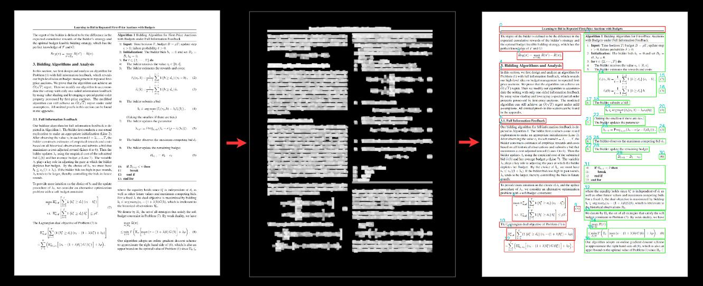

## Improved detecting algorithm for paper page layout

uses traditional computer vision based approach to detect text blocks in a paper page picture

## Description
pdftolatex is a simple tool that essentially "decompiles" a PDF file into the LaTex code that would have been used to create the PDF in the first place. Being a college student who uses LaTex for notes and homework typesetting, I created this tool after getting frustrated by all the time and effort I was spending copying down a homework templates or notes before working on them myself. pdftolatex helps reduce some of the grind.

The LaTex code generated by pdftolatex:
- Incudes the non-textual elements of the PDF in the LaTex code as part of figure environments (cropped images of these non-textual elements are stored in a local dir) 
- Includes the a default preamble (which can be customized if desired)
- Formats the code by seperating all paragraphs from the PDF using the \vspace command

## Usage
To use pdftolatex run `convert_pdf.py` with either the `--filepath` argument to convert a single PDF or the `--folderpath` argument to convert every PDF file in the folder. 

    python convert_pdf.py --filepath docs/example.pdf
    python convert_pdf.py --folderpath docs/example/

## Notes
### Packages Required
- OpenCV4 (cv2)
- pytesseract 
- pillow
- tqdm

### Future Improvements
PDF2Latex is a naive traditional computer vision based program which may not always create the best results. Currently working on updated deep learning based "PDF decompilation" tool in my free time(hopefully will be ready by Summer 2021). 
